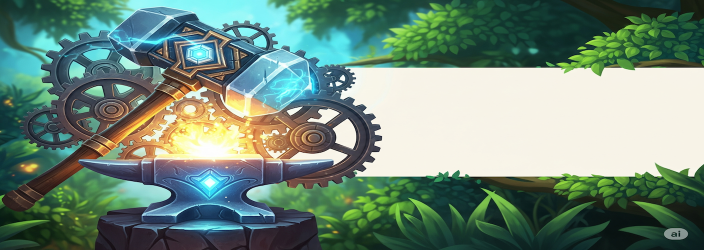
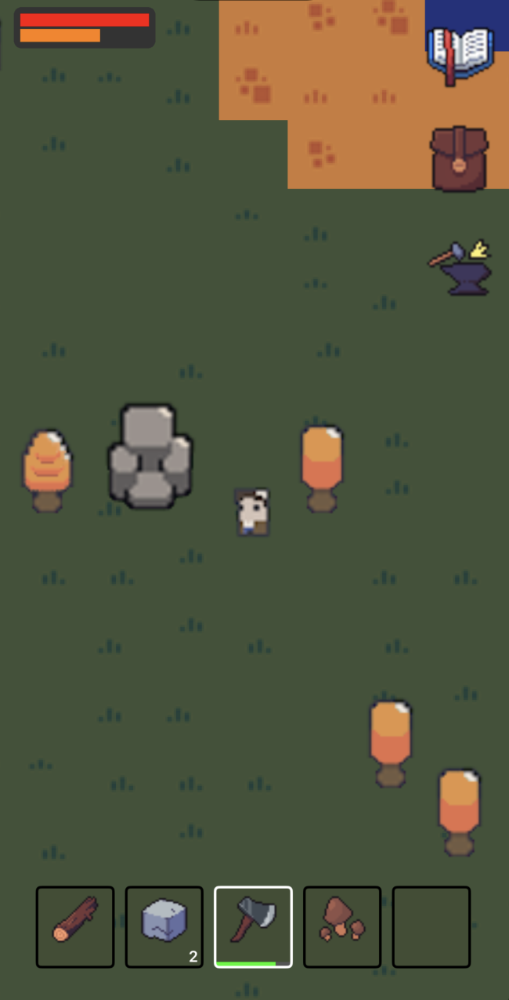
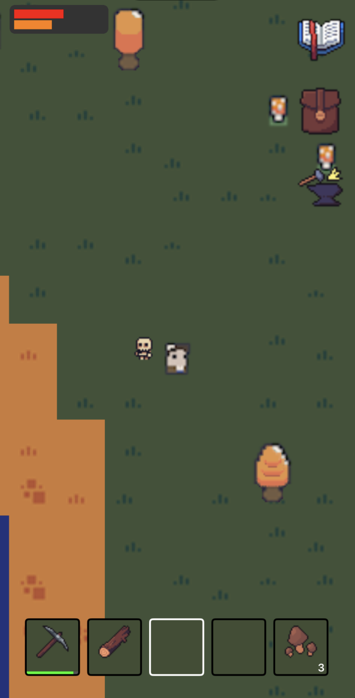
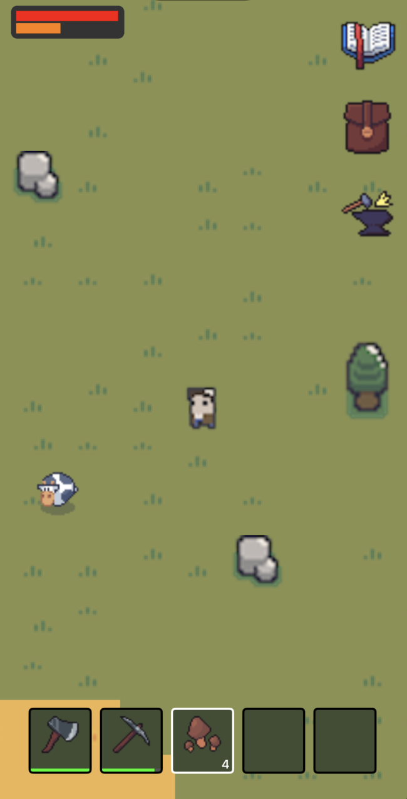
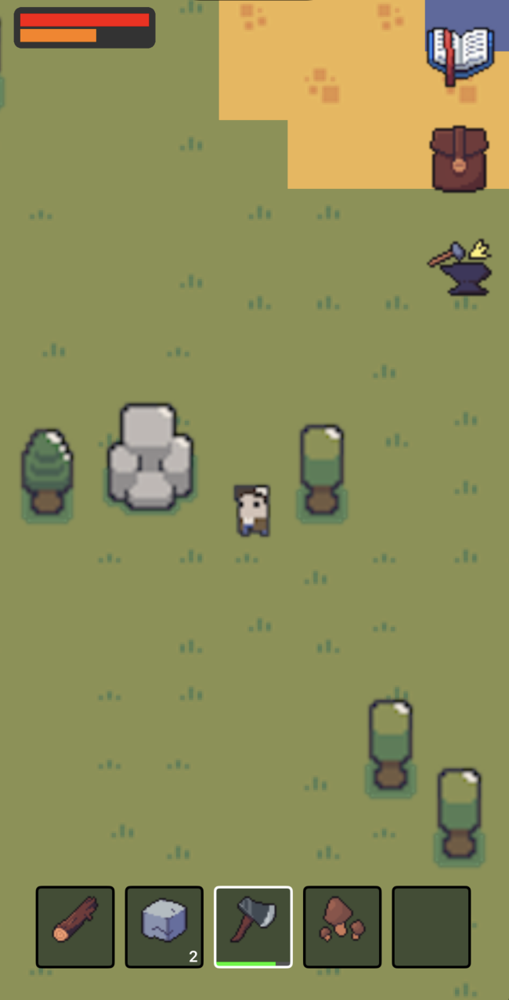

  

<h1 align="center">🏕 SurvivalCraft</h1>

  <em>SurvivalCraft</em> is a <strong>Proof of Concept (POC)</strong> top-down <strong>2D survival sandbox</strong> built with <strong>SpriteKit</strong>.  
    
  It showcases all the <strong>core gameplay systems</strong> you’d expect in a survival game:  
  <strong>procedural world generation, crafting, gathering, animal interactions, inventory & hotbar management, hunger & life systems, and a full save/load workflow</strong> — all running in a compact sandbox environment.  
    
  The game is designed with a fully <strong>data-driven architecture</strong>.  
  Scaling it into a full experience is as simple as <strong>adding new content to the database</strong>—tiles, objects, animals, and items—without touching core engine logic.  

  <a href="#-features">Features</a> • 
  <a href="#️-how-to-play">How to Play</a> • 
  <a href="#-screenshots--video">Screenshots & Video</a> • 
  <a href="#-future-plans">Future Plans</a> • 
  <a href="#-license">License</a>

---

## 🎥 Video Preview  

  <!-- Replace with your actual YouTube video link or hosted video -->
  

---

## ✨ Features  

### 🌍 Procedural World Generation  
- Noise-based generation with configurable **water thresholds & beach radii**  
- Multiple **terrain types** (water, beach, land)  
- **Dynamic object placement** (trees, rocks, etc.)  
- **Multi-tile objects**:  
  - Visual-only extensions (like tree canopies)  
  - Interactable core tiles  
- **Dark/Light Mode responsive** – world visuals adapt dynamically  

---

### 🪵 Objects & Interactions  
- Visual objects (grass, decorations)  
- Interactive objects (trees → wood, rocks → stone)  
- Click near an object to **gather resources**  
- Large objects spanning multiple tiles can have core & visual extension tiles  
- **Animals are interactable**:  
  - Hostile ones attack  
  - Passive ones flee or drop loot  

---

### 🎒 Inventory & Hotbar System  
- **35-slot inventory grid**  
- **Hotbar for quick access** to tools, food, weapons  
- Active item affects interactions (**eat, use tools**)  
- Supports:  
  - **Stackable items** (wood, berries)  
  - **Durability-based tools** that break over time  
- Actions: **eat food, use tools, rearrange, throw away items**  

---

### ❤️ Hunger & Life Systems  
- HUD displays **Health & Hunger**  
- Hunger decreases over time → health drains if starving  
- Eating restores hunger (& optionally health)  
- Taking damage (animals) reduces health  

---

### 🐄 Animals & AI  
- **Passive animals (cows)**:  
  - Wander randomly  
  - Flee when player gets close  
  - Drop resources on death  
- **Hostile animals (skeletons)**:  
  - Detect & chase players within **aggro radius**  
  - Stop walking immediately to **attack when in range**  
- Each has animations: **idle, walk, attack, hit, death**  
- **Loot tables** define what drops & with what probability  

---

### 💾 Save & Load System  
- Multiple **save slots**  
- Pause menu supports:  
  - **Load another world**  
  - **Overwrite current save**  
  - **Duplicate current world** into a new save  
  - **Delete worlds**  
- Saves capture full **world state**:  
  - Player position, stats & inventory  
  - Tilemap & objects  
  - Animals & their states  

---

### 🌙 Dynamic Theme Support  
- Fully **iOS Dark/Light Mode aware** – tiles & UI change dynamically  

---

## 🏗 Scalable Design  

This POC shows **all core gameplay systems** in small scale.  
To expand into a **full survival game**, just add more **data**:  

- More **tiles** (snow, desert, lava…)  
- More **objects** (crafting stations, traps, decorations…)  
- More **animals** (unique AI & loot tables)  
- More **items** for crafting, combat, base building  

All systems are **data-driven** → **no engine changes required**.  

---

## ▶️ How to Play  

1. **Create a new world** from the startup menu  
2. **Explore** and tap on objects to gather resources  
3. Use the **hotbar** to eat, equip tools, or use items  
4. Manage **hunger & health** carefully to survive  
5. Pause anytime to **save, duplicate, or delete** worlds  

---

## 📸 Screenshots & Video  

  
  

  
  

  ▶️ <a href="https://youtube.com/shorts/UBmsuI1fk6E?feature=share" target="_blank">Watch Gameplay Video</a>

---

## 📂 Future Plans  

- Crafting recipes for tools & structures  
- Day/Night cycles with **time-based enemy behavior**  
- Building & base construction  
- Diverse **biomes** with unique resources  
- Persistent animals & **breeding mechanics**  

---

## 📝 License  

This project is licensed under the **MIT License**.  
See the [LICENSE](./LICENSE) file for details.  

---

## 📬 Contact  

If you have questions or feedback, reach out via [email](mailto:itaybit10@gmail.com).

---
